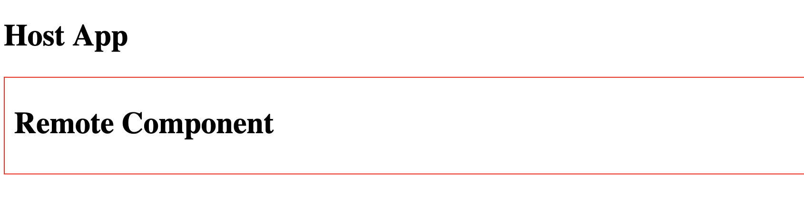

# react-19-mixed-env-mf

Demo of React 19 not working when using module federation and mixed `NODE_ENV`s.

## Getting Started

Run `npm i` in both directories. In `host`, run `npm run dev` to start the dev server
(`NODE_ENV === 'development'`). In `remote`, run `npm run build` and `npm run preview` to start
the preview server (`NODE_ENV === 'production'`).

Visit http://localhost:3010 and look at the console. Note that nothing is rendered.

Stop the preview server and run `npm run dev` from `remote`. Everything works as expected.

Stop both servers and run `npm run build && npm run preview` for both `host` and `remote`. Everything
again works as expected.

### React 18

If you downgrade both `host` and `remote` to react 18, these errors do not occur.

### Error Screenshot

### Successful Run Screenshot

