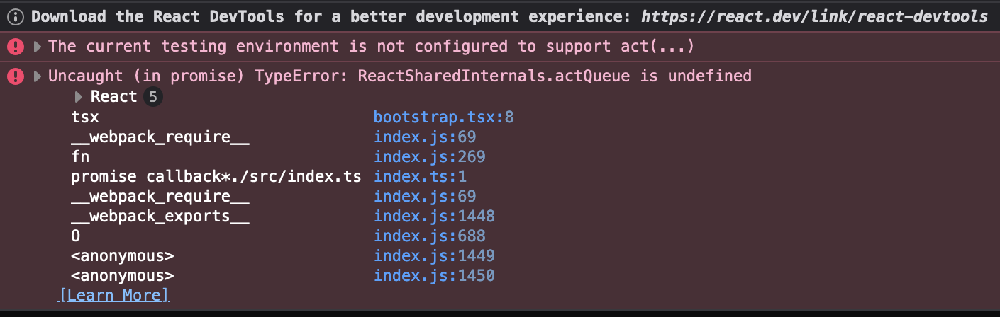

# react-19-mixed-env-mf

Demo of React 19 not working when using module federation and mixed `NODE_ENV`s.

## Getting Started

Run `npm i` and `npm start` from the root of this project. The `start` command will run
the dev server for the host and will build the remote, followed by starting the remote's
preview server.

Visit http://localhost:3010 and look at the console. Note that nothing is rendered.

Running both apps via the `npm run dev` command will not result in the same error.

### React 18

If you downgrade both `host` and `remote` to react 18, these errors do not occur.

### Error Screenshot

### Successful Run Screenshot

